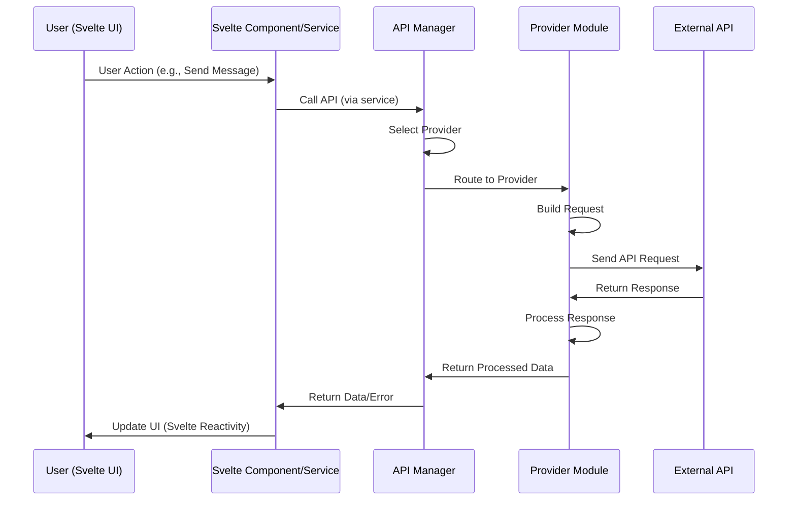

# ArisuTalk Architecture Guide

This document provides a comprehensive overview of ArisuTalk's architecture, focusing on the modular design, component organization, and system patterns implemented in the latest version.

## Table of Contents
1. [System Overview](#system-overview)
2. [Frontend Architecture](#frontend-architecture)
3. [Settings System Architecture](#settings-system-architecture)
4. [Internationalization Architecture](#internationalization-architecture)
5. [State Management](#state-management)
6. [API Integration Layer](#api-integration-layer)
7. [Event Handling System](#event-handling-system)
8. [Security Architecture](#security-architecture)

## System Overview

ArisuTalk follows a **client-server architecture** with a modern Svelte 5 frontend and a Kotlin-based backend. The system is designed with modularity, responsiveness, and internationalization as core principles.

### High-Level Architecture

```
┌─────────────────────────────────────────────────────────────┐
│                    ArisuTalk System                         │
├─────────────────────────────────────────────────────────────┤
│  Frontend (Svelte 5/Vite)                                  │
│  ├── Svelte Components                                     │
│  ├── Svelte Stores (State Management)                      │
│  ├── API Integration Layer                                 │
│  ├── Internationalization (i18n)                          │
│  └── Event Handling System                                 │
├─────────────────────────────────────────────────────────────┤
│  Backend (Kotlin/Gradle)                                   │
│  ├── API Endpoints                                         │
│  ├── Business Logic                                        │
│  └── Data Processing                                       │
├─────────────────────────────────────────────────────────────┤
│  External APIs                                             │
│  ├── Google Gemini                                         │
│  ├── OpenAI ChatGPT                                        │
│  ├── Anthropic Claude                                      │
│  ├── xAI Grok                                              │
│  ├── OpenRouter                                            │
│  └── Custom OpenAI APIs                                    │
└─────────────────────────────────────────────────────────────┘
```

## Frontend Architecture

The frontend is currently undergoing a significant migration from a legacy vanilla JavaScript codebase to **Svelte 5**. This transition aims to leverage Svelte's reactivity, component-based model, and performance benefits for a more maintainable and scalable application.

For a detailed breakdown of the Svelte 5 frontend architecture, including its component hierarchy, core concepts, and specific file structures, please refer to the dedicated document: [`frontend/docs/architecture.md`](./frontend/docs/architecture.md).

### Key Principles of Svelte 5 Frontend

#### 1. **Reactivity and Runes**
Svelte 5 utilizes a highly reactive programming model with **runes** for efficient state management and automatic UI updates. This eliminates the need for a virtual DOM and reduces boilerplate code.

#### 2. **Component-Based Development**
All UI elements are encapsulated as reusable Svelte components (`.svelte` files). This promotes modularity, reusability, and easier maintenance.

#### 3. **Svelte Stores for State Management**
Global and shared application state is managed using Svelte stores. These provide a simple yet powerful mechanism for reactive data flow across components.

#### 4. **Modular Services**
Business logic and complex operations are abstracted into TypeScript services, ensuring a clean separation of concerns from UI components.

## Settings System Architecture

The settings system is built with **Svelte components**, providing a modular and responsive user interface for managing application configurations. It features distinct layouts for desktop and mobile devices, ensuring an optimized experience across platforms.

For detailed information on the settings system's component structure and implementation, refer to [`frontend/docs/architecture.md`](./frontend/docs/architecture.md).

### Modular Panel System

The settings are organized into modular panels, each responsible for a specific category of settings (e.g., API configurations, appearance, character defaults). These panels are implemented as Svelte components, allowing for easy extension and maintenance.

```
Settings Architecture (Svelte-based)
├── UI Layer (Svelte Components)
│   ├── Desktop Settings UI (e.g., DesktopSettingsUI.svelte)
│   │   ├── Tab Navigation
│   │   ├── Centered Layout
│   │   └── Panel Container
│   └── Mobile Settings UI (e.g., MobileSettings.svelte)
│       ├── Page-based Navigation
│       ├── Touch Optimization
│       └── Responsive Design
└── Settings Panels (Svelte Components in src/lib/components/modals/settings/panels/)
    ├── APISettingsPanel.svelte
    ├── AppearanceSettingsPanel.svelte
    ├── CharacterDefaultsPanel.svelte
    ├── DataManagementPanel.svelte
    └── AdvancedSettingsPanel.svelte
```

### Settings Flow

```mermaid
graph TB
    A[User Opens Settings] --> C{Device Type?}
    C -->|Desktop| D[DesktopSettingsUI.svelte]
    C -->|Mobile| E[MobileSettings.svelte]
    D --> F[Load Selected Svelte Panel Component]
    E --> F
    F --> G[Render Panel Content]
    G --> H[User Interaction (Svelte Events)]
    H --> I[Svelte Store Update]
    I --> J[Save to Storage]
    J --> K[Update UI (Svelte Reactivity)]
    K --> L[Notify Other Components (Svelte Events/Stores)]
```

## Internationalization Architecture

ArisuTalk features a comprehensive internationalization (i18n) system, fully integrated with the Svelte frontend. This system allows for real-time language switching and ensures that all user-facing text is translatable.

For a detailed guide on the i18n system, including its structure, language file organization, translation functions, and how to add new languages, please refer to the dedicated document: [`docs/I18N.md`](./docs/I18N.md).

### i18n System Structure (Svelte Integrated)

```
Internationalization Layer
├── Core Module (src/i18n.js)
│   ├── Language Detection
│   ├── Translation Function (t())
│   ├── Language Switching Logic
│   └── Fallback Handling
├── Language Files (src/language/)
│   ├── Korean (ko.ts)
│   └── English (en.ts)
└── Integration Points (Svelte Components)
    ├── Component Templates (using t() function)
    ├── Dynamic Content
    ├── API Responses
    └── Error Handling
```

## State Management

In the Svelte frontend, state management is primarily handled through **Svelte stores**. These reactive stores provide a centralized and efficient way to manage application data and ensure that UI components automatically update when the underlying state changes.

### Central State Architecture (Svelte Stores)

```
State Management System
├── Application State (Svelte Stores in src/lib/stores/)
│   ├── User Settings (settings.ts)
│   ├── Chat State (chat.ts)
│   ├── UI State (ui.ts)
│   └── Character Data (character.ts)
├── Storage Layer (src/storage.ts & src/lib/utils/secureStorage.js)
│   ├── IndexedDB Interface
│   ├── localStorage Fallback
│   ├── Data Serialization
│   └── Migration Handling
├── Secure Storage (src/lib/utils/secureStorage.js)
│   ├── Encryption/Decryption
│   ├── Key Management
│   └── Master Password System
└── State Synchronization
    ├── Component Updates (Svelte Reactivity)
    ├── Cross-tab Sync
    └── Persistence Management
```

### State Flow Pattern (Svelte)

```mermaid
graph LR
    A[User Action (e.g., Svelte Event)] --> B[Svelte Component Logic]
    B --> C[Svelte Store Update]
    C --> D[Storage Write (via service/utility)]
    D --> E[UI Update (Svelte Reactivity)]
    E --> F[Other Components React (Svelte Subscriptions)]
```

## API Integration Layer

The API integration layer facilitates communication with various external AI providers and the ArisuTalk backend. In the Svelte frontend, API calls are typically initiated from services or directly from Svelte components, leveraging a centralized API manager.

### API Architecture (Svelte Integrated)

```
API Integration Layer
├── API Manager (src/lib/api/apiManager.js)
│   ├── Provider Selection
│   ├── Request Routing
│   ├── Response Handling
│   └── Error Management
├── Provider Modules (src/lib/api/)
│   ├── OpenAI (openai.js)
│   ├── Claude (claude.js)
│   ├── Gemini (gemini.js)
│   ├── Grok (grok.js)
│   ├── OpenRouter (openrouter.js)
│   └── Custom OpenAI (customopenai.js)
├── Prompt System (src/prompts/)
│   ├── Prompt Builder (promptBuilder.js)
│   ├── Template Management (chatMLPrompts.ts)
│   └── Context Handling
└── Configuration
    ├── Provider Constants (src/constants/providers.ts)
    ├── Model Definitions
    └── Default Settings
```

### API Request Flow



## Event Handling System

In the Svelte frontend, event handling primarily relies on Svelte's built-in event directives (`on:event`) and custom event dispatching. This provides a declarative and efficient way to manage user interactions and inter-component communication.

### Event Architecture (Svelte)

```
Event Handling System
├── Svelte Event Directives (on:click, on:input, etc.)
├── Custom Events (createEventDispatcher)
├── Svelte Stores (for global events/state changes)
├── Component Lifecycle Events (onMount, onDestroy)
└── Global Event Listeners (for window/document level events, with cleanup)
```

### Event Listener Management (Svelte)

Svelte components automatically manage event listeners declared with `on:event` directives. For global event listeners or those attached to elements outside the component's direct control, `onMount` and `onDestroy` lifecycle hooks are used for proper setup and cleanup.

```svelte
<script>
  import { onMount, onDestroy } from 'svelte';

  let count = 0;

  function handleClick() {
    count += 1;
  }

  // Example of a global event listener with cleanup
  function handleKeydown(event) {
    if (event.key === 'Escape') {
      console.log('Escape pressed!');
    }
  }

  onMount(() => {
    window.addEventListener('keydown', handleKeydown);
  });

  onDestroy(() => {
    window.removeEventListener('keydown', handleKeydown);
  });
</script>

<button on:click={handleClick}>Clicked {count} times</button>
```

## Security Architecture

### Security Layers

```
Security Architecture
├── Data Encryption (src/lib/utils/crypto.js)
│   ├── AES Encryption
│   ├── Key Derivation
│   └── Salt Generation
├── Secure Storage (src/lib/utils/secureStorage.js)
│   ├── API Key Protection
│   ├── User Data Encryption
│   └── Master Password System
├── Input Validation (Frontend & Backend)
│   ├── Form Validation (Svelte components)
│   ├── XSS Prevention
│   └── Data Sanitization
└── API Security (Backend & External APIs)
    ├── Request Signing
    ├── Rate Limiting
    └── Error Handling
```

### Data Flow Security

```mermaid
graph TD
    A[User Input (Svelte UI)] --> B[Input Validation (Svelte Component)]
    B --> C[Data Sanitization]
    C --> D[Encryption Layer]
    D --> E[Secure Storage]
    E --> F[API Transmission]
    F --> G[Response Processing]
    G --> H[Decryption]
    H --> I[UI Display (Svelte Reactivity)]
```

## Performance Considerations

### Optimization Strategies

1.  **Lazy Loading**: Components and panels are loaded on demand.
2.  **Event Debouncing**: Rapid user inputs are debounced to prevent excessive API calls.
3.  **Caching**: API responses and UI states are cached for improved performance.
4.  **Memory Management**: Svelte's automatic reactivity minimizes manual memory management, but global event listeners are properly cleaned up.
5.  **Bundle Optimization**: Vite optimizes the JavaScript bundle for production, including tree-shaking and code splitting.

### Scalability Patterns

1.  **Modular Architecture**: New features can be added as independent Svelte modules and components.
2.  **Plugin System**: Components use ID attributes for potential plugin integration.
3.  **Configuration-Driven**: Settings and providers are configuration-driven for easy extension.
4.  **Internationalization Ready**: New languages can be added by extending language files.

## Conclusion

ArisuTalk's architecture emphasizes:

-   **Modularity**: Components are loosely coupled and independently testable.
-   **Reactivity**: Leveraging Svelte 5 for efficient UI updates and state management.
-   **Responsiveness**: Adaptive UI for different device types.
-   **Internationalization**: Comprehensive multi-language support.
-   **Security**: Multiple layers of data protection.
-   **Maintainability**: Clear separation of concerns and consistent patterns.
-   **Extensibility**: Easy to add new features, languages, and API providers.

This architecture supports the current feature set while providing a solid foundation for future enhancements and scalability.