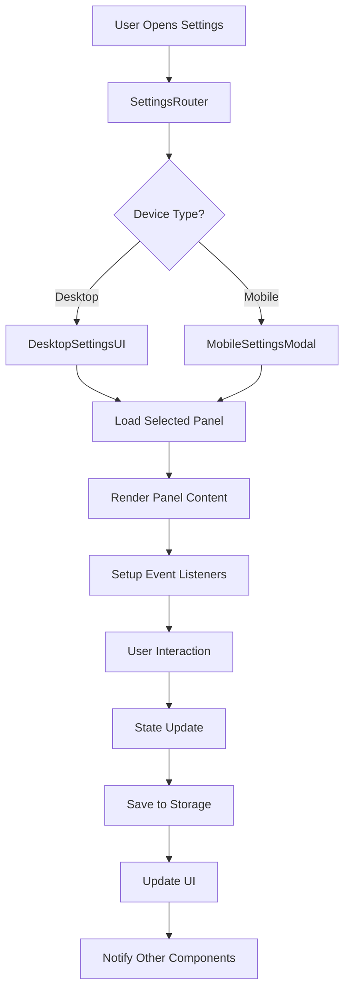

# ArisuTalk Architecture Guide

This document provides a comprehensive overview of ArisuTalk's architecture, focusing on the modular design, component organization, and system patterns implemented in the latest version.

## Table of Contents
1. [System Overview](#system-overview)
2. [Frontend Architecture](#frontend-architecture)
3. [Settings System Architecture](#settings-system-architecture)
4. [Internationalization Architecture](#internationalization-architecture)
5. [State Management](#state-management)
6. [API Integration Layer](#api-integration-layer)
7. [Event Handling System](#event-handling-system)
8. [Security Architecture](#security-architecture)

## System Overview

ArisuTalk follows a **client-server architecture** with a modern JavaScript frontend and a Kotlin-based backend. The system is designed with modularity, responsiveness, and internationalization as core principles.

### High-Level Architecture

```
┌─────────────────────────────────────────────────────────────┐
│                    ArisuTalk System                         │
├─────────────────────────────────────────────────────────────┤
│  Frontend (JavaScript/Vite)                                │
│  ├── UI Layer (Components)                                 │
│  ├── State Management (index.js)                           │
│  ├── API Integration Layer                                 │
│  ├── Internationalization (i18n)                          │
│  └── Event Handling System                                 │
├─────────────────────────────────────────────────────────────┤
│  Backend (Kotlin/Gradle)                                   │
│  ├── API Endpoints                                         │
│  ├── Business Logic                                        │
│  └── Data Processing                                       │
├─────────────────────────────────────────────────────────────┤
│  External APIs                                             │
│  ├── Google Gemini                                         │
│  ├── OpenAI ChatGPT                                        │
│  ├── Anthropic Claude                                      │
│  ├── xAI Grok                                              │
│  ├── OpenRouter                                            │
│  └── Custom OpenAI APIs                                    │
└─────────────────────────────────────────────────────────────┘
```

## Frontend Architecture

### Component Hierarchy

The frontend follows a **component-based architecture** with clear separation of concerns:

```
Application Root (index.js)
├── UI Manager (ui.js)
├── State Manager (index.js)
├── Settings Router (SettingsRouter.js)
│   ├── Desktop Settings (DesktopSettingsUI.js)
│   │   ├── API Settings Panel
│   │   ├── Appearance Settings Panel
│   │   ├── Character Defaults Panel
│   │   ├── Data Management Panel
│   │   └── Advanced Settings Panel
│   └── Mobile Settings (MobileSettingsModal.js)
├── Main Chat (MainChat.js)
├── Group Chat (GroupChat.js)
├── Sidebar (Sidebar.js)
└── Modal System
    ├── Character Modal
    ├── Prompt Modal
    ├── Debug Logs Modal
    ├── Master Password Modal
    └── Confirmation Modal
```

### Design Patterns

#### 1. **Module Pattern**
Each component is encapsulated as a module with clear interfaces:

```javascript
// Example component structure
export function ComponentName() {
    // Private variables and functions
    let privateState = {};
    
    function privateMethod() {
        // Implementation
    }
    
    // Public interface
    return {
        init: function() { /* Initialize component */ },
        render: function() { /* Render UI */ },
        cleanup: function() { /* Cleanup resources */ }
    };
}
```

#### 2. **Observer Pattern**
State changes trigger UI updates through event listeners:

```javascript
// State change notification
window.dispatchEvent(new CustomEvent('settingsChanged', {
    detail: { section: 'api', data: newSettings }
}));
```

#### 3. **Factory Pattern**
Settings panels are created dynamically based on device type:

```javascript
// SettingsRouter.js
function createSettingsUI(deviceType) {
    if (deviceType === 'desktop') {
        return new DesktopSettingsUI();
    } else {
        return new MobileSettingsModal();
    }
}
```

## Settings System Architecture

### Modular Panel System

The settings system has been completely restructured into a modular architecture:

```
Settings Architecture
├── Router Layer (SettingsRouter.js)
│   ├── Device Detection
│   ├── UI Selection Logic
│   └── Component Initialization
├── UI Layer
│   ├── Desktop Interface (DesktopSettingsUI.js)
│   │   ├── Tab Navigation
│   │   ├── Centered Layout
│   │   └── Panel Container
│   └── Mobile Interface (MobileSettingsModal.js)
│       ├── Modal Layout
│       ├── Touch Optimization
│       └── Responsive Design
└── Panel Layer (settings/panels/)
    ├── APISettingsPanel.js
    ├── AppearanceSettingsPanel.js
    ├── CharacterDefaultsPanel.js
    ├── DataManagementPanel.js
    └── AdvancedSettingsPanel.js
```

### Settings Flow



### Panel Architecture

Each settings panel follows a consistent structure:

```javascript
// Panel Structure Template
export function PanelName() {
    return {
        id: 'panel-id',
        title: 'Panel Title',
        render: function(container) {
            // Generate panel HTML
            container.innerHTML = this.generateHTML();
            this.setupEventListeners(container);
        },
        generateHTML: function() {
            // Return panel HTML content
        },
        setupEventListeners: function(container) {
            // Add event listeners for panel interactions
        },
        validate: function() {
            // Validate panel data
        },
        getData: function() {
            // Return current panel data
        },
        setData: function(data) {
            // Set panel data
        }
    };
}
```

## Internationalization Architecture

### i18n System Structure

```
Internationalization Layer
├── Core System (i18n.js)
│   ├── Language Detection
│   ├── Translation Function (t())
│   ├── Language Switching
│   └── Fallback Handling
├── Language Files
│   ├── Korean (ko.js)
│   │   ├── UI Translations
│   │   ├── API Messages
│   │   ├── Error Messages
│   │   └── System Notifications
│   └── English (en.js)
│       ├── UI Translations
│       ├── API Messages
│       ├── Error Messages
│       └── System Notifications
└── Integration Points
    ├── Component Templates
    ├── Dynamic Content
    ├── API Responses
    └── Error Handling
```

### Translation Key Organization

```javascript
// Language file structure
export const translations = {
    // UI Components
    ui: {
        buttons: { /* button texts */ },
        labels: { /* form labels */ },
        placeholders: { /* input placeholders */ }
    },
    
    // API Integration
    api: {
        errors: { /* API error messages */ },
        success: { /* success messages */ },
        providers: { /* provider-specific texts */ }
    },
    
    // Modals and Dialogs
    modal: {
        titles: { /* modal titles */ },
        messages: { /* modal content */ },
        actions: { /* action buttons */ }
    },
    
    // Settings Panels
    settings: {
        api: { /* API settings */ },
        appearance: { /* appearance settings */ },
        character: { /* character settings */ },
        data: { /* data management */ },
        advanced: { /* advanced settings */ }
    }
};
```

## State Management

### Central State Architecture

```
State Management System
├── Application State (index.js)
│   ├── User Settings
│   ├── Chat State
│   ├── UI State
│   └── Cache Management
├── Storage Layer (storage.js)
│   ├── IndexedDB Interface
│   ├── localStorage Fallback
│   ├── Data Serialization
│   └── Migration Handling
├── Secure Storage (secureStorage.js)
│   ├── Encryption/Decryption
│   ├── Key Management
│   └── Secure Data Handling
└── State Synchronization
    ├── Component Updates
    ├── Cross-tab Sync
    └── Persistence Management
```

### State Flow Pattern


## API Integration Layer

### API Architecture

```
API Integration Layer
├── API Manager (apiManager.js)
│   ├── Provider Selection
│   ├── Request Routing
│   ├── Response Handling
│   └── Error Management
├── Provider Modules
│   ├── OpenAI (openai.js)
│   ├── Claude (claude.js)
│   ├── Gemini (gemini.js)
│   ├── Grok (grok.js)
│   ├── OpenRouter (openrouter.js)
│   └── Custom OpenAI (customopenai.js)
├── Prompt System
│   ├── Prompt Builder (promptBuilder.js)
│   ├── Template Management (prompts.js)
│   └── Context Handling
└── Configuration
    ├── Provider Constants (providers.js)
    ├── Model Definitions
    └── Default Settings
```

### API Request Flow


## Event Handling System

### Event Architecture

```
Event Handling System
├── Modal Handlers (modalHandlers.js)
│   ├── Modal Lifecycle
│   ├── Form Validation
│   └── Data Persistence
├── Chat Handlers
│   ├── Main Chat (mainChatHandlers.js)
│   ├── Group Chat (groupChatHandlers.js)
│   └── Message Processing
├── UI Handlers
│   ├── Sidebar (sidebarHandlers.js)
│   ├── Settings Panels
│   └── Component Interactions
└── System Events
    ├── Language Changes
    ├── Theme Updates
    └── Settings Synchronization
```

### Event Listener Management

```javascript
// Event listener pattern with cleanup
function setupEventListeners(container) {
    const elements = container.querySelectorAll('[data-action]');
    
    elements.forEach(element => {
        if (!element.dataset.listenerAdded) {
            element.addEventListener('click', handleAction);
            element.dataset.listenerAdded = 'true';
        }
    });
}

function handleAction(event) {
    const action = event.target.dataset.action;
    // Handle specific actions
}

// Cleanup when component is destroyed
function cleanup(container) {
    const elements = container.querySelectorAll('[data-listener-added]');
    elements.forEach(element => {
        element.removeEventListener('click', handleAction);
        delete element.dataset.listenerAdded;
    });
}
```

## Security Architecture

### Security Layers

```
Security Architecture
├── Data Encryption (crypto.js)
│   ├── AES Encryption
│   ├── Key Derivation
│   └── Salt Generation
├── Secure Storage (secureStorage.js)
│   ├── API Key Protection
│   ├── User Data Encryption
│   └── Master Password System
├── Input Validation
│   ├── Form Validation
│   ├── XSS Prevention
│   └── Data Sanitization
└── API Security
    ├── Request Signing
    ├── Rate Limiting
    └── Error Handling
```

### Data Flow Security


## Performance Considerations

### Optimization Strategies

1. **Lazy Loading**: Components and panels are loaded on demand
2. **Event Debouncing**: Rapid user inputs are debounced to prevent excessive API calls
3. **Caching**: API responses and UI states are cached for improved performance
4. **Memory Management**: Event listeners are properly cleaned up to prevent memory leaks
5. **Bundle Optimization**: Vite optimizes the JavaScript bundle for production

### Scalability Patterns

1. **Modular Architecture**: New features can be added as independent modules
2. **Plugin System**: Components use ID attributes for potential plugin integration
3. **Configuration-Driven**: Settings and providers are configuration-driven for easy extension
4. **Internationalization Ready**: New languages can be added by extending language files

## Conclusion

ArisuTalk's architecture emphasizes:
- **Modularity**: Components are loosely coupled and independently testable
- **Responsiveness**: Adaptive UI for different device types
- **Internationalization**: Comprehensive multi-language support
- **Security**: Multiple layers of data protection
- **Maintainability**: Clear separation of concerns and consistent patterns
- **Extensibility**: Easy to add new features, languages, and API providers

This architecture supports the current feature set while providing a solid foundation for future enhancements and scalability.