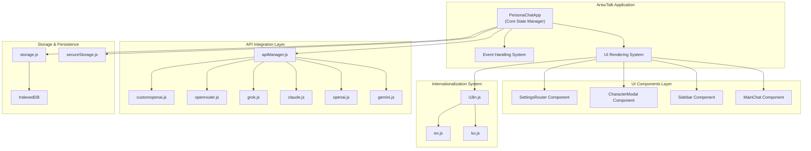

## Project Overview
ArisuTalk is an AI chat frontend application that provides a modern, responsive interface for interacting with multiple AI providers through customizable character personas . Its main goals include offering comprehensive internationalization support and multi-provider AI integration capabilities . The application is a Progressive Web Application (PWA) that supports real-time multilingual conversations, comprehensive character management, and seamless integration with major AI services like Google Gemini, OpenAI, Anthropic Claude, xAI Grok, and OpenRouter . The target audience includes users who want to interact with AI characters and developers looking for a modular and extensible AI chat frontend .

## Architecture & Structure
### High-level Architecture Overview
ArisuTalk follows a centralized state management pattern with a single-page application architecture . The core application, `PersonaChatApp`, orchestrates all components through event-driven interactions and reactive rendering .

 

### Key Directories and their Purposes
The project has a monorepo structure with `frontend/` and `backend/` directories .
- `frontend/src/api/`: Contains API integrations for various AI providers like `apiManager.js`, `claude.js`, `gemini.js`, `grok.js`, `openai.js`, `openrouter.js`, and `customopenai.js` .
- `frontend/src/components/`: Houses UI components such as `MainChat.js`, `Sidebar.js`, `CharacterModal.js`, and `SettingsRouter.js` .
- `frontend/src/handlers/`: Stores event handlers for different UI areas, including `mainChatHandlers.js`, `sidebarHandlers.js`, and `modalHandlers.js` .
- `frontend/src/language/`: Contains language files for internationalization, specifically `en.js` and `ko.js` .
- `frontend/src/utils/`: Provides utility functions like `crypto.js` for cryptographic operations and `secureStorage.js` for secure data storage .

### Main Components and How They Interact
The `PersonaChatApp` class (`frontend/src/index.js`) is the central orchestrator, managing application state and coordinating between subsystems . It interacts with:
- **UI Rendering System**: Handled by `frontend/src/ui.js`, which renders components like `Sidebar`, `MainChat`, and various modals based on the application state .
- **Event Handling System**: Event listeners are delegated through the main application element, with specific handlers in `frontend/src/handlers/` modules (e.g., `handleSidebarClick`, `handleMainChatClick`, `handleModalClick`) updating the application state .
- **API Integration Layer**: `APIManager` (`frontend/src/api/apiManager.js`) handles communication with various AI providers .
- **Storage Layer**: `frontend/src/storage.js` manages data persistence using IndexedDB, while `frontend/src/utils/secureStorage.js` handles secure storage for sensitive data like API keys  .

### Data Flow and System Design
The application state is managed by `PersonaChatApp.state` and persisted using a debounced system to optimize storage performance . State changes trigger debounced save functions (`debouncedSaveSettings`, `debouncedSaveCharacters`, etc.) that write data to IndexedDB via `saveToBrowserStorage` . Secure data is handled by `secureStorage.js` .

## Development Setup
### Prerequisites and Dependencies
- Node.js (version 20 or higher) 
- pnpm (version 10.14.0 or higher) 

### Installation Steps
1. Clone the repository: `git clone https://github.com/concertypin/ArisuTalk` 
2. Navigate to the project directory: `cd ArisuTalk` 
3. Install dependencies: `pnpm install` 

### Environment Configuration
The application uses Vite for its build system . Environment-specific settings are managed through Vite's configuration, such as `publicDir` for static assets .

### How to Run the Project Locally
- Start the frontend development server: `pnpm dev:fe` . The application will be available at `http://localhost:5173` .
- Start the backend (optional): `pnpm dev:be` .

## Code Organization
### Coding Standards and Conventions
- **JSDoc Documentation**: Use JSDoc for all functions and components . `.d.ts` files can also be used . Avoid using `Object` type as it doesn't provide enough type information .
- **File Size Limit**: Keep files under 300 lines when possible .
- **Async Functions**: Always include `async` in function declarations if the function is asynchronous .
- **HTML Separation**: Avoid HTML strings in JS files .
- **Internationalization**: Use the `t()` function for all user-facing text . Add new translation keys to both `ko.js` and `en.js` .
- **Event Handling**: Use `data-listener-added` to prevent duplicate listeners . Ensure DOM elements exist before adding event listeners . Remove event listeners when components are destroyed .

### File Naming Patterns
Files are generally named descriptively based on their purpose, e.g., `apiManager.js`, `CharacterModal.js`, `sidebarHandlers.js` .

### Import/Export Patterns
The codebase uses ES6+ Modules for modular code organization . Imports are typically at the top of files, as seen in `frontend/src/index.js` .

### Component Structure
UI components are organized within the `frontend/src/components/` directory . Settings panels are further modularized under `frontend/src/components/settings/panels/` .

## Key Features & Implementation
### Main Features and How They're Implemented
- **AI Integration**: Supports multiple AI providers (Gemini, OpenAI, Claude, Grok, OpenRouter, Custom APIs) . This is implemented through an abstraction layer in `frontend/src/api/` with `apiManager.js` routing requests to specific provider files like `gemini.js`, `openai.js`, etc. .
- **Character Management**: Allows creation and management of AI bots with customizable personas . Character data, including prompts and memories, is stored in the application state and persisted . Default character configurations are defined in `frontend/src/defaults.js` .
- **Internationalization (i18n)**: Provides full Korean and English language support with real-time switching . All user-facing text uses the `t()` function from `frontend/src/i18n.js` . Language files are located in `frontend/src/language/` .
- **Secure Storage**: Encrypts sensitive data like API keys  using `frontend/src/utils/secureStorage.js` .
- **Debug Logging**: A comprehensive logging system is available for troubleshooting . Debug logs can be enabled via settings, and entries are added using `addDebugLog` and `addStructuredLog` methods in the `PersonaChatApp` class .

### Important Algorithms or Business Logic
- **Debounced Persistence**: State changes are saved to storage with a 500ms debounce delay to prevent excessive writes and improve performance . This is implemented using the `debounce` utility function <cite repo="

# Development Partnership and How We Should Partner

We build production code together. I handle implementation details while you guide architecture and catch complexity early.

## Core Workflow: Research → Plan → Implement → Validate

**Start every feature with:** "Let me research the codebase and create a plan before implementing."

1. **Research** - Understand existing patterns and architecture
2. **Plan** - Propose approach and verify with you
3. **Implement** - Build with tests and error handling
4. **Validate** - ALWAYS run formatters, linters, and tests after implementation

## Code Organization

**Keep functions small and focused:**
- If you need comments to explain sections, split into functions
- Group related functionality into clear packages
- Prefer many small files over few large ones

## Architecture Principles

**This is always a feature branch:**
- Delete old code completely - no deprecation needed
- No "removed code" or "added this line" comments - just do it

**Prefer explicit over implicit:**
- Clear function names over clever abstractions
- Obvious data flow over hidden magic
- Direct dependencies over service locators

## Maximize Efficiency

**Parallel operations:** Run multiple searches, reads, and greps in single messages
**Multiple agents:** Split complex tasks - one for tests, one for implementation
**Batch similar work:** Group related file edits together

## Problem Solving

**When stuck:** Stop. The simple solution is usually correct.

**When uncertain:** "Let me ultrathink about this architecture."

**When choosing:** "I see approach A (simple) vs B (flexible). Which do you prefer?"

Your redirects prevent over-engineering. When uncertain about implementation, stop and ask for guidance.

## Testing Strategy

**Match testing approach to code complexity:**
- Complex business logic: Write tests first (TDD)
- Simple CRUD operations: Write code first, then tests
- Hot paths: Add benchmarks after implementation

**Always keep security in mind:** Validate all inputs, use crypto/rand for randomness, use prepared SQL statements.

**Performance rule:** Measure before optimizing. No guessing.

## Progress Tracking

- **Use Todo lists** for task management
- **Clear naming** in all code

Focus on maintainable solutions over clever abstractions.

---
Generated using [Sidekick Dev]({REPO_URL}), your coding agent sidekick.
